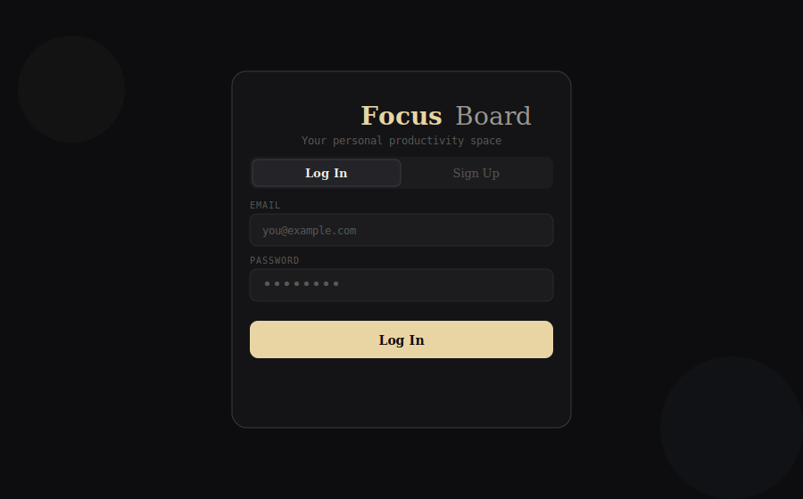
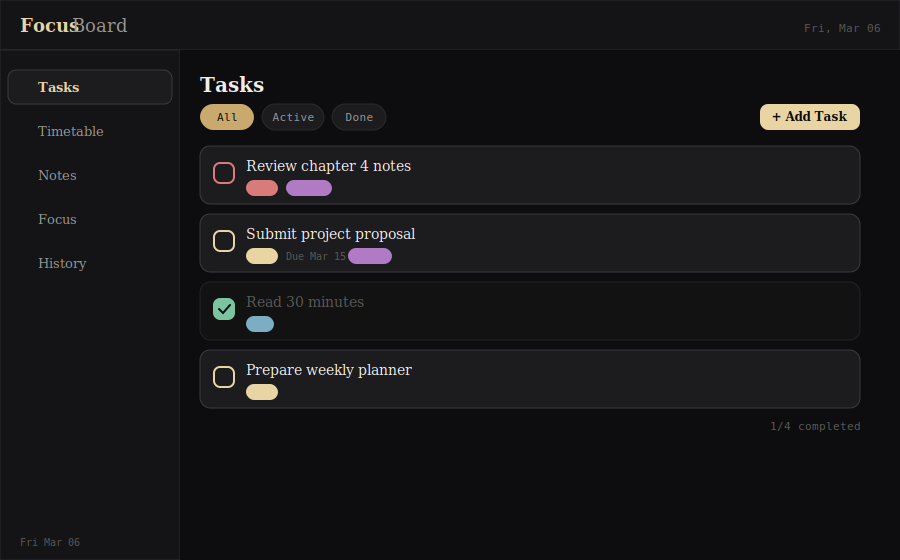
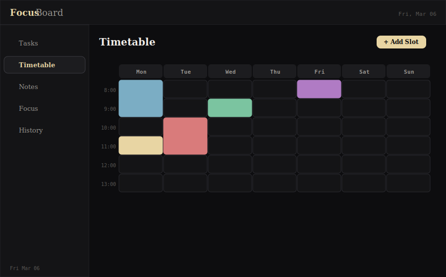
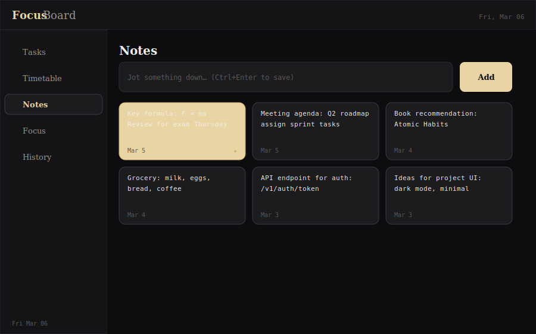
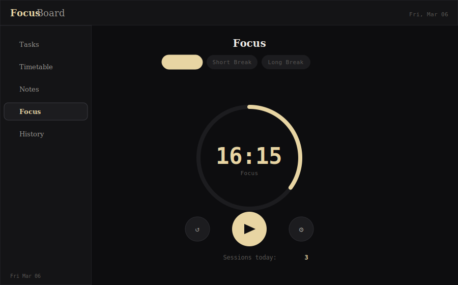
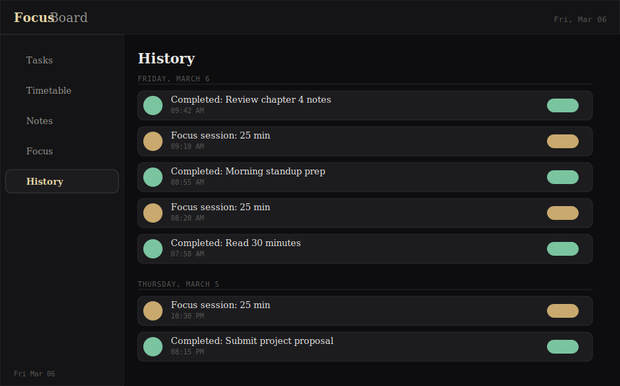

<div align="center">

# ✦ Focus Board

**A unified productivity dashboard for students and professionals**


_Plan → Execute → Record → Review_

</div>

---

## Overview

Focus Board is a single-platform productivity application that replaces the need to juggle multiple apps for daily organization. It combines task management, routine planning, quick notes, a Pomodoro timer, and activity history into one cohesive, distraction-free environment — backed by Supabase for real-time persistence and user authentication.

---

## Screenshots

### 🔐 Authentication

> Secure email/password login and sign-up with session persistence across page reloads.



---

### ✅ Task Management

> Create, prioritize, filter, and track tasks with tags, due dates, and completion states.



---

### 📅 Timetable Board

> Plan your week visually with color-coded time slots across a Mon–Sun grid.



---

### 📝 Notes

> Capture quick ideas and reminders. Pin important notes to keep them at the top.



---

### ⏱ Focus Timer

> Pomodoro-style countdown with animated ring, customizable durations, and auto session switching.



---

### 📊 History

> A chronological log of completed tasks and focus sessions, grouped by day.



---

## Features

| Module          | Capabilities                                                                                                       |
| --------------- | ------------------------------------------------------------------------------------------------------------------ |
| **Tasks**       | Create, edit, delete tasks · Priority levels (Low / Med / High) · Due dates · Tags · Filter by All / Active / Done |
| **Timetable**   | Weekly grid (Mon–Sun, 6am–10pm) · Color-coded slots · Custom duration · Delete slots                               |
| **Notes**       | Quick-capture notes · Inline editing · Pin/unpin · Grid layout · Ctrl+Enter shortcut                               |
| **Focus Timer** | Pomodoro countdown · Animated SVG ring · Adjustable work/break durations · Auto mode switching · Session counter   |
| **History**     | Activity log from tasks + timer · Grouped by date · Synced from Supabase · Live refresh on new events              |
| **Auth**        | Email/password sign-up & login · Supabase session management · Per-user data isolation via RLS                     |

---

## Tech Stack

- **Frontend / Framework** — [Next.js](https://nextjs.org/) (App Router, `"use client"`)
- **Backend / Database** — [Supabase](https://supabase.com/) (PostgreSQL + Auth + Row Level Security)
- **Styling** — CSS custom properties injected client-side (no hydration conflicts)
- **Icons** — Inline SVG paths (zero dependencies)
- **Fonts** — [Syne](https://fonts.google.com/specimen/Syne) (display) + [DM Mono](https://fonts.google.com/specimen/DM+Mono) (data/code)

---

## Database Schema

Four tables are created in your Supabase project, each scoped to the authenticated user via Row Level Security:

```sql
todos             -- id, user_id, text, priority, due, done, tags[], created_at
timetable_slots   -- id, user_id, day, hour, duration, label, color, created_at
notes             -- id, user_id, text, pinned, created_at, updated_at
history           -- id, user_id, type, label, time
```

All tables have RLS policies ensuring users can only read and write their own rows.

---

## Getting Started

### Prerequisites

- Node.js 18+
- A [Supabase](https://supabase.com) project (free tier works)

### 1. Clone and install

```bash
git clone https://github.com/your-username/focus-board.git
cd focus-board
npm install
```

### 2. Set up the database

Open your Supabase project → **SQL Editor** → paste and run the contents of [`supabase_schema.sql`](./supabase_schema.sql).

This creates all tables, enables Row Level Security, and sets up the RLS policies.

### 3. Configure environment variables

Create a `.env.local` file in the project root:

```env
NEXT_PUBLIC_SUPABASE_URL=https://your-project-id.supabase.co
NEXT_PUBLIC_SUPABASE_ANON_KEY=eyJhbGciOiJIUzI1NiIsInR5cCI6IkpXVCJ9...
```

Find these values in your Supabase dashboard under **Project Settings → API**.

### 4. Place the component

Copy `FocusBoard.jsx` to:

```
app/page.jsx
```

### 5. Run the dev server

```bash
npm run dev
```

Open [http://localhost:3000](http://localhost:3000) — sign up, and start using Focus Board.

---

## Project Structure

```
focus-board/
├── app/
│   └── page.jsx              ← FocusBoard.jsx (main component)
├── supabase_schema.sql       ← Run once in Supabase SQL Editor
├── .env.local                ← Your Supabase credentials (not committed)
└── package.json
```

The entire application is a single self-contained React component. Each module (Tasks, Timetable, Notes, Timer, History, Auth) is a function component defined in the same file for portability.

---

## How It Works

```
User signs up / logs in
        │
        ▼
   Supabase Auth ──── issues JWT session
        │
        ▼
  Dashboard loads ──── fetches user's data from 4 tables
        │
   ┌────┴────┬──────────┬──────────┬──────────┐
   ▼         ▼          ▼          ▼          ▼
 Tasks   Timetable    Notes     Timer      History
   │         │          │          │          │
   └─────────┴──────────┴──────────┴──────────┘
                        │
                   All writes go to
                   Supabase (RLS scoped)
                        │
                   History tab re-fetches
                   on task complete / timer end
```

---

## Productivity Loop

The application is designed around a four-stage cycle:

1. **Plan** — Add tasks in the To-Do module, schedule blocks in the Timetable
2. **Execute** — Use the Pomodoro timer to work in structured intervals
3. **Record** — Completed tasks and sessions are automatically logged to History
4. **Review** — Browse the History tab to reflect on patterns and progress

---

## Future Enhancements

- [ ] Push notifications and due-date reminders
- [ ] Recurring task automation
- [ ] Productivity analytics and streak tracking
- [ ] Calendar integration (Google Calendar sync)
- [ ] Dark / light theme toggle
- [ ] Exportable productivity reports (CSV / PDF)
- [ ] Goal tracking module
- [ ] Real-time collaboration (Supabase Realtime)

---

## Contributing

Pull requests are welcome. For major changes, please open an issue first to discuss what you'd like to change.

1. Fork the repo
2. Create a feature branch: `git checkout -b feature/your-feature`
3. Commit your changes: `git commit -m 'Add some feature'`
4. Push to the branch: `git push origin feature/your-feature`
5. Open a pull request

---

## License

[MIT](LICENSE) — feel free to use, modify, and distribute.

---

<div align="center">

Built with Next.js · Supabase · ☕

</div>
